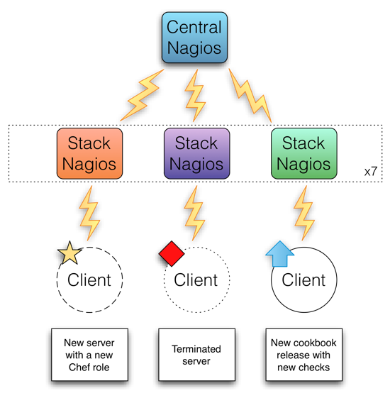
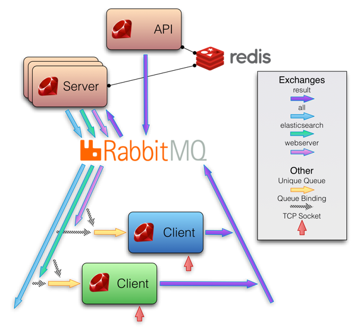
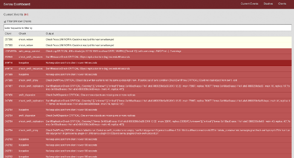
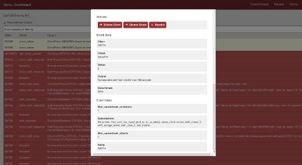

!SLIDE
# Sensu #

!SLIDE bullets
# Why a New Framework? #

* \#monitoringsucks
* Existing systems not built for CM
* Deal with our scalability pain points
* Use Ruby!

!SLIDE center
Sonian's old Nagios architecture

!SLIDE bullets
# Problems with Nagios #

* Configuration is unpleasant & restrictive
* Cannot discover new servers on its own
* Easily overwhelmed with a high number of clients & checks
* Difficult to extend & hack

!SLIDE center
# Enter Sensu

"a monitoring framework that aims to be simple, malleable, and scalable."

!SLIDE center
# Sensu Architecture #

!SLIDE bullets
# Buzzword Bingo #
* Ruby (EventMachine, Sinatra, AMQP)
* RabbitMQ
* Redis
* travis-ci
* Messages are JSON
* Backends: Graphite, Librato, etc

!SLIDE bullets
# Components #
* sensu-server
* sensu-client
* sensu-api
* sensu-dashboard

!SLIDE bullets
# sensu-server #
* Triggers checks periodically (to RabbitMQ)
* Persists data in Redis
* Recieves check results from clients
* Sends to handler scripts for processing

!SLIDE bullets
# sensu-client #
* Subscribes to tags ("webserver", "elasticsearch", etc)
* Runs checks in response to messages (from RabbitMQ)
* Can also run "standalone" checks on its own schedule

!SLIDE bullets
# sensu-api #
* Typically on same instance as sensu-server
* Provides HTTP API for components like dashboard

!SLIDE bullets
# sensu-dashboard #
* Web interface
* Can resolve events, create stashes ("silence")

!SLIDE center
# Blurry Screenshots #

  

!SLIDE bullets
# Configuration #

!SLIDE bullets
# Checks (defined on server) #

    @@@ json
    "checks": {
      "my_check": {
        "description": "Name of the check",
        "command": "my-check.rb --foo bar"
        "interval": 60,
        "auto_resolve": false,
        "subscribers": [
          "linux"
        ]
      }
    }

!SLIDE bullets
# Plugin Interface #

* Plugins are just scripts
* Re-use Nagios conventions
* 0 = OK, 1 = failure, etc...
* Message on standard output

!SLIDE
# sensu-plugin gem #

Instead of reimplementing the plugin conventions:

    @@@ ruby
    require 'sensu-plugin/check/cli'
    class MyCheck < Sensu::Plugin::Check::CLI
      option :foo, :short => '-f', :long => '--foo'
      def run
        if my_service_is_working?
          ok "It's all good"
        else
          critical "Something failed"
        end
      end
    end

!SLIDE bullets
# Handlers #

## Receive: ##

* Check name/description/output
* Client custom attributes
* Check result history/flapping state

!SLIDE bullets
# Handlers #

Can do things like...

* Create incidents in PagerDuty
* Report to IRC
* Process metrics (can use plain text instead of JSON)

!SLIDE bullets
# Deployment #
* Apt/Yum repositories
* "Omnibus" style packages
* Cookbooks included

!SLIDE bullets
# More Information #
* https://github.com/sensu/sensu/wiki/
* \#sensu on Freenode
